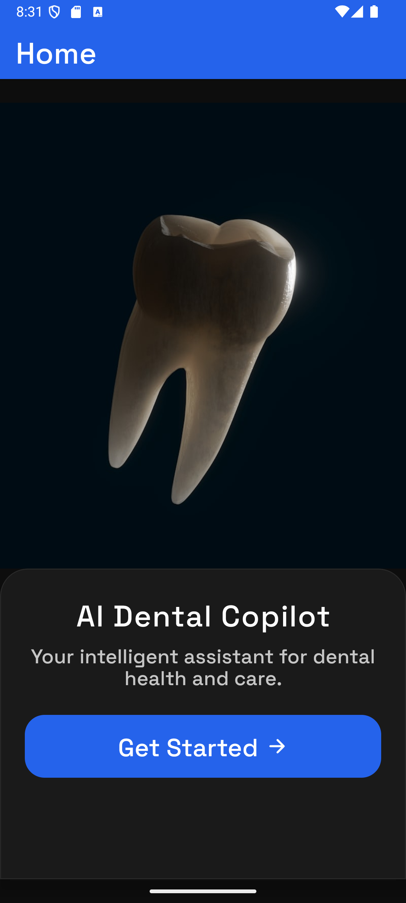
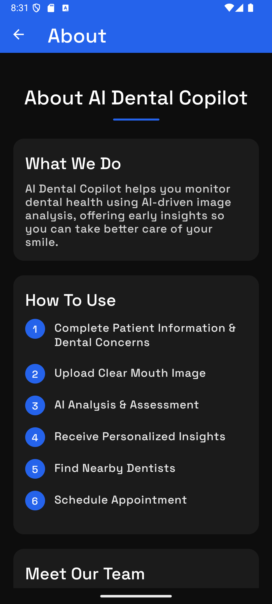
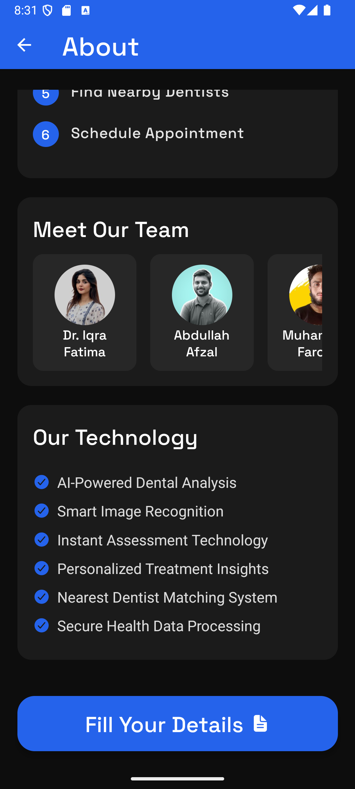
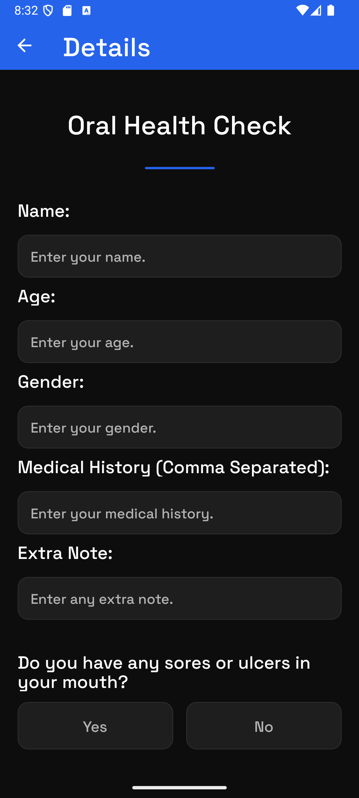
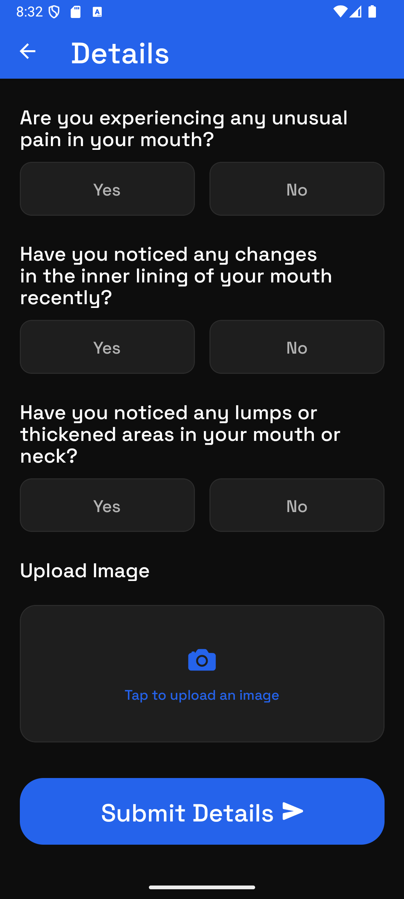
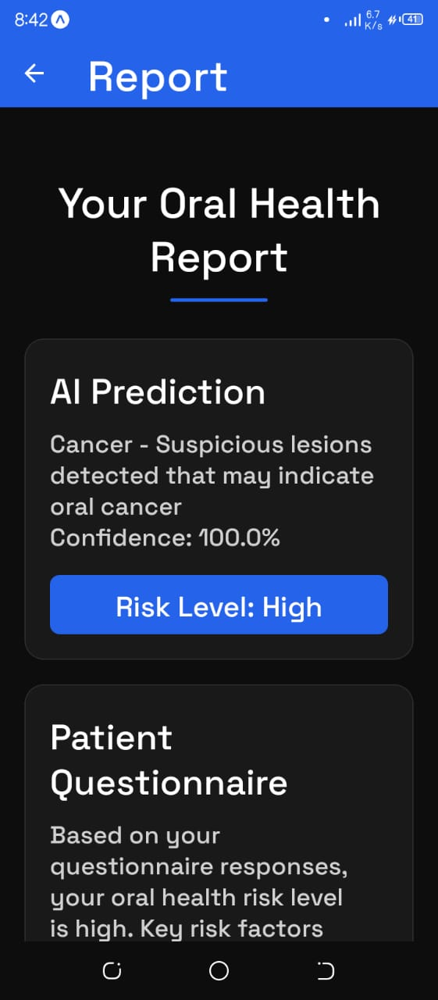
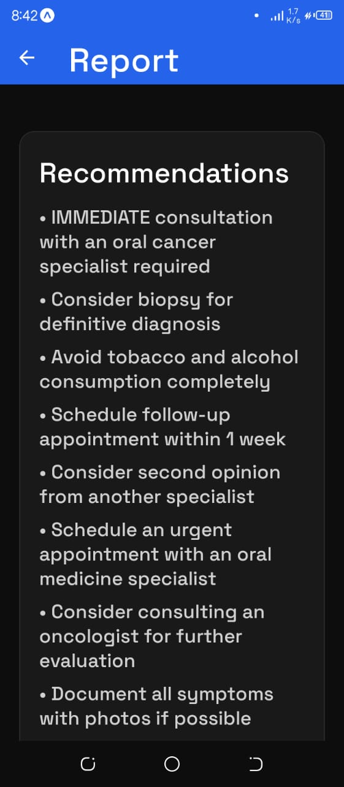
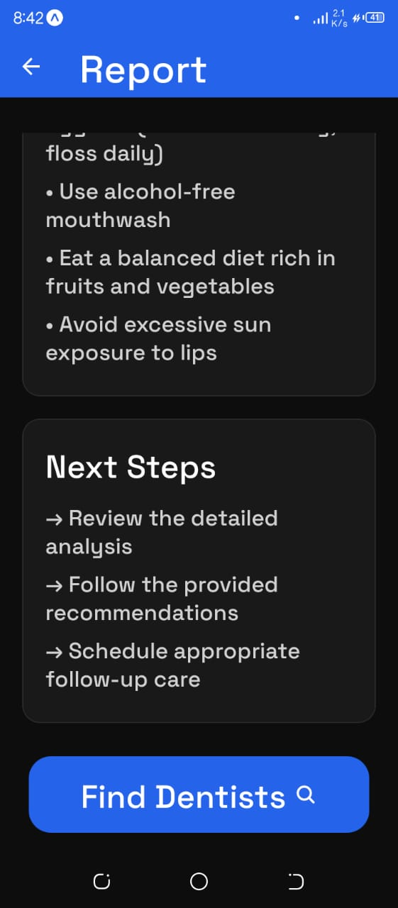
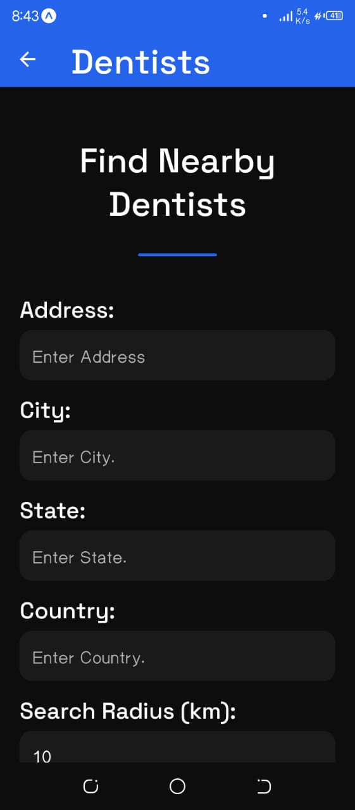
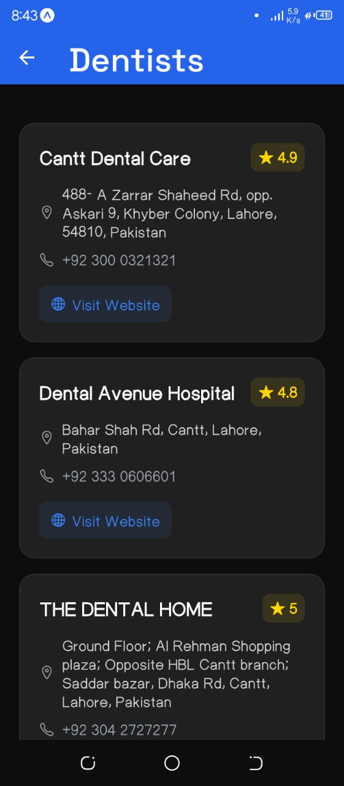

## Features

- AI-Powered Analysis: Upload dental images for instant AI analysis
- Symptom Assessment: Input your symptoms for personalized recommendations
- Professional Insights: Get guidance on whether to seek professional care
- User-Friendly Interface: Intuitive design with dark theme for comfortable use
- Secure Data Handling: Your health information remains private and secure

# Screens

## Home Screen

### The welcoming interface with a clear call-to-action to begin your dental health assessment.



## About Screen

### Learn about our mission, team, and how to use the application effectively.




# Details Screen

### Input your dental concerns, symptoms, and upload relevant images.




# Report Screen

### Receive your AI-generated dental health assessment with recommendations.





# Dentist Screen

### Find information about professional dental care options and when to seek help.




# Installation

1. Ensure you have Node.js installed on your system
2. Clone or download this project
3. Navigate to the project directory and install dependencies:

```
npm install
```

4. Start the development server:

```
npx expo start --tunnel
```

## Running the App

### After starting the development server, you can run the app on:

- Expo Go: Scan the QR code with your iOS or Android device using the Expo Go app
- Android Emulator: Open with Android Studio emulator
- iOS Simulator: Run on macOS with Xcode simulator
- Development Build: Use with a prebuilt development client

## Technology Stack

- Frontend: React Native with Expo
- Navigation: React Navigation
- UI Components: React Native core components with custom styling
- AI Integration: Custom machine learning models for dental image analysis

## Usage

1. Open the app and navigate to the Details screen
2. Fill in your dental concerns and symptoms
3. Upload clear images of the area in question
4. Submit for AI analysis
5. Review your personalized report and recommendations
6. Use the information to decide on next steps for your dental care

## Important Notes

- This application provides preliminary assessments only and is not a replacement for professional dental care
- Always consult with a qualified dentist for official diagnoses and treatment plans
- Image quality significantly impacts the accuracy of AI analysis

### Disclaimer: AI Dental Copilot is designed to assist with preliminary dental health assessments only. It does not provide medical diagnoses or replace professional dental care. Always consult with a qualified healthcare provider for medical advice.
